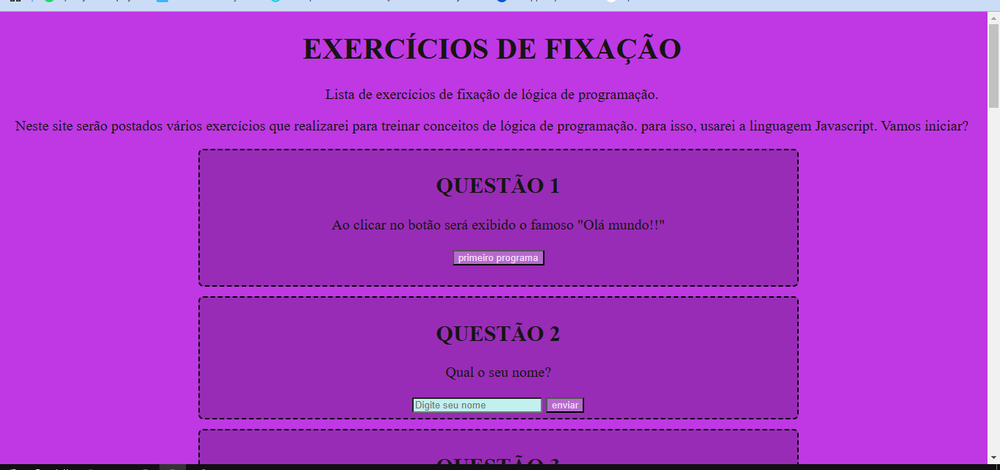
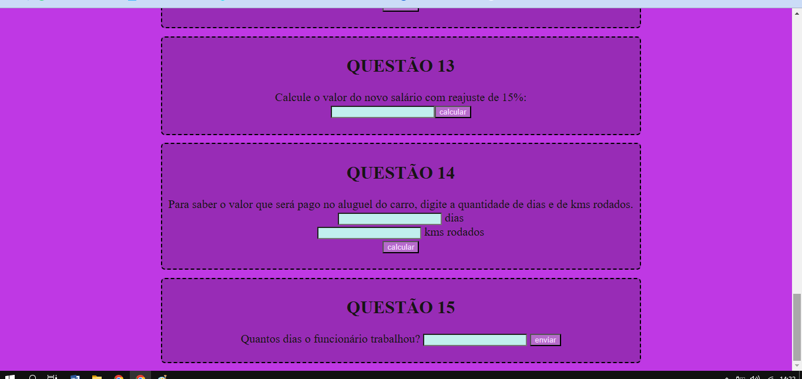

# Lógica de Programação - Desafios Interativos

Bem-vindo(a) ao repositório da página [Lógica de Programação](https://polianaelizabeth.github.io/logica/)! 🎯

Este projeto tem como objetivo oferecer pequenos desafios de lógica de programação em caixas interativas, ajudando iniciantes e praticantes a desenvolverem suas habilidades com raciocínio lógico e programação.

## 🚀 Como acessar?
Basta visitar o link: [https://polianaelizabeth.github.io/logica/](https://polianaelizabeth.github.io/logica/)

## 📸 Capturas de Tela
Aqui estão algumas imagens da página em funcionamento:





## 🛠 Tecnologias utilizadas
Este projeto foi desenvolvido utilizando as seguintes tecnologias:
- HTML
- CSS
- JavaScript

## 🛠 Como contribuir?
1. Faça um **fork** deste repositório.
2. Clone o repositório para sua máquina:
   ```sh
   git clone https://github.com/seu-usuario/logica.git
   ```
3. Crie uma nova branch para suas alterações:
   ```sh
   git checkout -b minha-melhoria
   ```
4. Faça suas alterações e envie para o repositório.
5. Crie um **pull request** explicando as mudanças.

## 📌 Como ajudar a melhorar a página?
Queremos tornar esta página ainda mais interativa e útil! Deixe sugestões ou contribua com:
- Novos desafios de lógica
- Melhorias no design e na interatividade
- Correções de erros e aprimoramentos na experiência do usuário

💡 **O que você acha que poderia melhorar? Alguma funcionalidade extra que faria diferença?** Comente ou envie um pull request! 🚀

## 📄 Licença
Este projeto está sob a licença MIT. Sinta-se livre para usar e contribuir!

---
🔗 **Desenvolvido por [Poliana Elizabeth](https://github.com/polianaelizabeth)**

